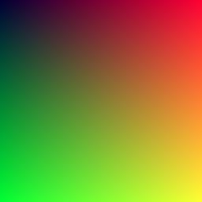
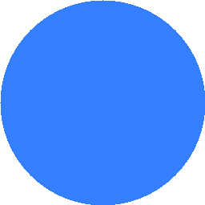

# Atividade 01 - I/O de imagens. 
**Objetivo**: Classe própria para salvar imagens.

### Documentação
Nessa Primeira atividade, a princípio segui o tutorial até a seção 2, assim, consegui a realizar a saída de uma imagem, um quadrado degradê, no formato `img.ppm` por meio do código `main.cpp` que foi compilado gerando o arquivo `main.exe` que ao ser executado foi escrito no arquivo `first-image.ppm`. Já para vizualizar essa imagem foi necessária uma extensão do VScode que permite a vizualização de arquivos `.ppm`.

Com isso, foi possível compreender como criar imagens de quadrados e circulos, desse modo, fiz um código inicial semelhante a ao `main.cpp` para construir um círculo. Então, iniciei o desenvolvimento do código `class_save_img.cpp` a fim de criar a classe `ImageSaver()` responsável por salvar imagens no formato `.png`, utilizando a biblioteca **libpng**. Dessa maneira, foi preciso a instalação da biblioteca em meu computador. Portanto, com a biblioteca inclusa e classe criada, houve a construção da `main()`, que gera **imagens de um quadrado degradê, de um circulo azul e de um quadrado vermelho**, e onde os objetos dessa imagens são criados para que possa-se utilizar da classe para salavar essas imagens no formato `png`. Com a compilação do código `class_save_img.cpp` no arquivo executável `classe` as imagens em png são geradas com seus determinados títulos.

Dessa forma, para a documentação da atividade, o passo a passo está documentado neste `README`, já para a documentação do código `class_save_img.cpp` foi utlizada a ferramenta `doxygen`, por meio de uma extensão da ferramenta para o VSCode, então, o código está documentado em comentários seguindo a formatação disponibilizada pelo `doxygen`.

### Imagens
Degrade

Circulo

Quadrado

### Fontes
https://raytracing.github.io/books/RayTracingInOneWeekend.html#overview  
https://raytracing.github.io/books/RayTracingInOneWeekend.html?authuser=0#outputanimage  
http://www.libpng.org/pub/png/libpng.html  
https://www.doxygen.nl/

### Roadmap
1. [x] Seguir o “tutorial” até a seção 2;
2. [x] Criar uma classe própria para salvar imagens, utilize bibliotecas como libpng, CImg e ImageMagick;
3. [x] Gere pelo menos três imagens. Exemplos: 
    - [x] degradê, 
    - [x] círculo, 
    - [x] quadrado, etc... 
4. [x] Faça uma breve documentação: 
    - [x] doxygen +
    - [x] readme;