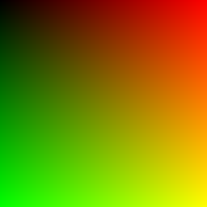

# Atividade 02 - Operações Matriciais. 
**Objetivo**: Criar uma classe própria para manipular vetores e matrizes.

### Documentação
A princípio, segui o **tutorial da seção 3** copiando e depois estudando os códigos `vec3.h`, `color.h` e `main.cpp` que geram a imagem da seção 2 (um quadrado degrade) no formato *ppm*. Nesse sentido, esse conjunto de códigos geram a imagem com cores *rgb* `degrade.ppm`. Para visualização da imagem utilizei uma extensão do VSCode para o formato *.ppm*. Porém, a fim de documentação também a salvei como *.png*:

Dessa maneira, para continuar o desenvolvimento e expandi-lo para manipulação de outros vetores e de matrizes, criei um arquivo `vetor.h` para armazenar as classes dos vetores (`vec3`, `vec2` e `vec4`) e outro arquivo `matriz.h` para as classes das matrizes (`mat2`, `mat3` e `mat4`).

Com isso, iniciei o desenvolvimento das **classes de vetores, `vec2` e `vec4`**, utilizando o código do `vec3` como base. Com as classes construídas, realizei os testes unitários para estas, no arquivo `testes.cpp`.

Já para a criação das **classes de matrizes `mat2`, `mat3` e `mat4`**,

Para os **testes unitários** utilizei a biblioteca Google Test e criei o arquivo `testes.cpp`.

**Legenda**  
`vec3` - Vetor tridimensional  
`vec2` - Vetor bidimensional  
`vec4` - Vetor

`mat2` - Matriz 2x2  
`mat3` - Matriz 3x3  
`mat3` - Matriz 4x4  

Para a **documentação**, este `README` foi construido ao longo do desenvolvimento da atividade e para documentar os códigos utilizei da extensão do *doxygen* para o *VSCode* a fim de gerar comentários que explicasse os códigos de modo objetivo.

### Fontes
https://raytracing.github.io/books/RayTracingInOneWeekend.html#thevec3class  
https://google.github.io/googletest/  

### Roadmap
- [x] Seguir o “tutorial” até a seção 3
- [] Criar uma classe própria para manipular vetores e matrizes, expanda para:
    - [x] vec2, vec4, 
    - [] mat2, mat3 e mat4
- [] Faça testes unitários, escolha uma biblioteca que facilite
- [x] Faça uma breve documentação