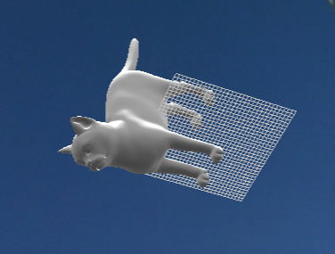
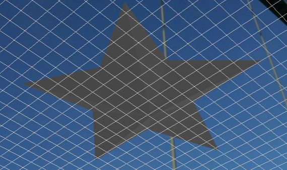

# Atividade 03 - I/O de malhas
**Objetivo:** Criar uma classe própria para ler modelos obj.

### Documentação
Primeiro, com o repositório criado fiz o download de dois objetos de modelo aberto e observei o formato obj. 
Com isso, para criar a classe que lê modelos `obj` criei a estrutura de vertice e uma função que realiza a leitura dos vertices do objeto.
Nesse sentido, precisei reestruturá-la para transformá-la em uma classe.

Para ter a classe encapsulei a funcionalidade existente, assim as funções se tornam métodos da classe que le os modelos obj, armazena os vértices e índices. Por isso a main cria uma instância da classe ObjFileReader e utiliza seus métodos para obter os dados do arquivo.

### Objetos dos teste

### Fontes
https://free3d.com/  

### Roadmap
1) - [x] Criar um repositório individual no github e enviar o endereço como comentário da atividade
2) - [x] Observar o formato obj, utilize algum repositório com modelos abertos, por exemplo: https://free3d.com/
3) - [x] Criar uma classe própria para ler modelos obj
4) - [x] Faça uma breve documentação e
        - [x] testes unitários