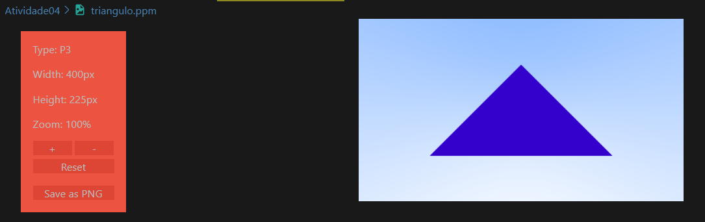

# Atividade 04 - Visualização Inicial

### Fontes
Tutorial 1: https://raytracing.github.io/books/RayTracingInOneWeekend.html  
Tutorial 2: https://raytracing.github.io/books/RayTracingTheNextWeek.html

### Roadmap
1) - [X] Siga o "tutorial 1" até a seção 5
2) - [X] Implemente a visualização da esfera, integrando com as implementações anteriores (Atividade 1 e Atividade 2)
3) - [X] Veja a seção 6.2 do "tutorial 2"
4) - [X] Implemente a visualização de um triângulo
5) - [X] Com a implementação da Atividade 3, visualize um objeto todo, lido de um arquivo
6) - [X] Documente adequadamente

## Documentação

### Tutorial 1 até a seção 5
Para essa etapa bastou seguir os códigos e explicações deles disponíveis no tutorial 1 até a seção 5 para ter o resultado final correto, que é o modelo de uma esfera vermelha em um fundo de gradiente azul. Esse resultado está disponível no arquivo `tutorial1.ppm`, já os arquivos usados para formar a cena foram: `main.cpp`, `vec3.h`, `color.h` e `ray.h`.

### Visualização da esfera, integrando com as implementações da Atividade 1 e Atividade 2
Nesse sentido, ocorre a integração das atividades 1, geração de imagens de formas geométricas, e atividade 2, manipulação de vetores e matrizes com a classe `vec3.h`.

### Tutorial 2 seção 6.2
A seção 6.2 fala sobre "*Ray-Plane Intersection*", que trata sobre a interseção entre um raio e um plano, com o objetivo de implementar essa funcionalidade. Então, fala sobre o processo de calcular a interseção entre um raio e um plano, utilizando a fórmula implícita do plano e o produto escalar. 

Além disso, a função ***hit()*** precisa ser implementada para verificar se um raio interage com o objeto, se sim, precisa determinar as propriedades dessa interseção, como: ponto de impacto, normal, coordenadas de textura. Para isso, é necessário encontrar o plano que contém o objeto, resolver a interseção entre um raio e o plano que contém o objeto e, assim, determinar se o ponto de impacto está dentro do objeto.

### Implementação da visualização de um triângulo
Para isso foi necessária escrever a função **hit_triangel()** para verificar se um raio atinge o triangulo. Então, adicionando a chamada da função dentro da função `ray_color`, como está a esfera, ao executar o `tri_exe` a imagem de um triângulo centarlizado na cena é gerada. Como nessa etapa tenho o objetivo de visualizar apenas o triângulo o trecho da esfera foi comentado, pois ela aparece sobre o a imagem do triângulo.

### Com a implementação da Atividade 3, visualize um objeto todo, lido de um arquivo
Primeiro, para que tivesse disponível um arquivo para visualizar o objeto utilizei a classe ` ObjFileReader.h` da atividade 3 para gerar o arquivo `piramide_leitura.txt` com os vertices e as faces do objeto a ser visualizado.

Objeto fonte :: Piramide

Já para visualizar o objeto a partir do arquivo, utilizeio do aprendizado da disciplina de ***Processamento Gráfico*** e construi uma visualização 
do objeto 3D usando *HTML* e *JavaScript*, utilizando a biblioteca `Three.js` para renderização 3D. Portanto o arquivo `obj_view.html` é o responsável por carregar o arquivo txt gerado a fim de obter a visualização do objeto descrito nele.  

Objeto visualizado

### Documentação
Para a documentação da atividade houve a descrição do passo a passo de cada etapa neste `README`, já para a documentação dos códigos utilizei o *doxygen* sempre que possível para comentar partes dos códigos, por isso alguns comentários estão em inglês pois a extensão do VSCode já gera a definição de determinadas partes do código, então complementei apenas quando necessário. Para os códigos onde não fiz uso do *doxygen* há comentários padrões para melhor explicações dos trechos.

## Observações e dificuldades
- Nessa atividade não consegui integrar a Atividade 01 corretamente, uma vez que, não consegui implementar a classe que salva imagens geradas no formato `.png` criada na Atividade 01.

- Optei por realizar a visualização 3D por meio de html e javascript pois não consegui com o c++ e suas bibliotecas, logo escolhi uma opção que já havia experiência.