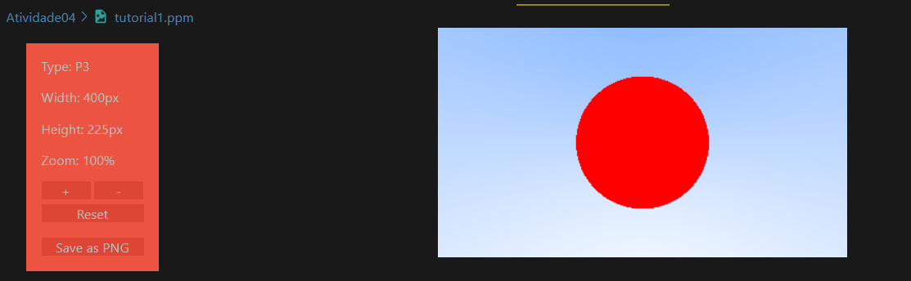

# Atividade 04 - Visualização Inicial

### Fontes
Tutorial 1: https://raytracing.github.io/books/RayTracingInOneWeekend.html  
Tutorial 2: https://raytracing.github.io/books/RayTracingTheNextWeek.html

### Roadmap
1) - [X] Siga o "tutorial 1" até a seção 5
2) - [X] Implemente a visualização da esfera, integrando com as implementações anteriores (Atividade 1 e Atividade 2)
3) - [] Veja a seção 6.2 do "tutorial 2"
4) - [] Implemente a visualização de um triângulo
5) - [] Com a implementação da Atividade 3, visualize um objeto todo, lido de um arquivo
6) - [X] Documente adequadamente

## Documentação

### Tutorial 1 até a seção 5
Para essa etapa bastou seguir os códigos e explicações deles disponíveis no tutorial 1 até a seção 5 para ter o resultado final correto, que é o modelo de uma esfera vermelha em um fundo de gradiente azul. Esse resultado está disponível no arquivo `tutorial1.ppm`, já os arquivos usados para formar a cena foram: `main.cpp`, `vec3.h`, `color.h` e `ray.h`.

### Visualização da esfera, integrando com as implementações da Atividade 1 e Atividade 2
Nesse sentido, para integrar as implementações das Atividades **1**, geração de imagens de formas geométricas e possibilidade de salvar estas imagens, e **2**, manipulação de vetores e matrizes, primeiro transfomei a classe que salva imagens em um arquivo `.h` para utiliza-lo na `main.cpp` da Atividade 4. 

Com isso, juntei as classes `vec3`, `vec2` e `vec4` numa só classe chamada `vetores.h` para integrar a `main.cpp` desta atividade e substituir a `vec3.h`

