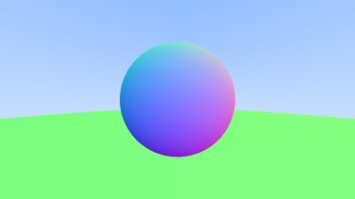
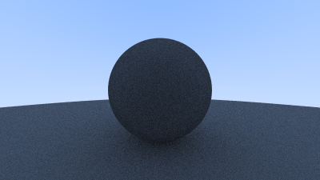
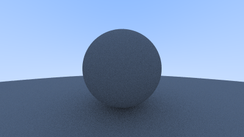
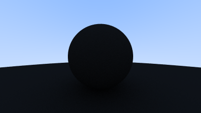
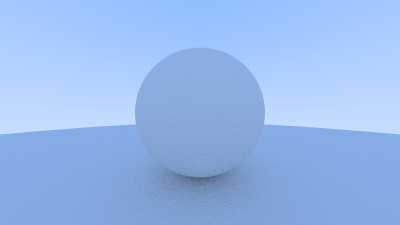
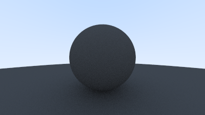
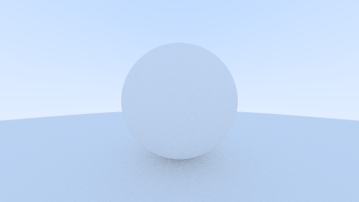

# Atividade 05 - Materiais Difusos

### Fontes
Tutorial: https://raytracing.github.io/books/RayTracingInOneWeekend.html

### Roadmap
1) - [X] Siga o tutorial, especialmente as seções 6, 7, 8 e 9.
2) - [] Implemente o material difuso, usando a normal do modelo (utilize um arquivo com informação de normal)
3) - [] Visualize uma cena (com pelo menos três objetos) e de dois pontos de vista diferente.
4) - [X] Documente adequadamente

## Documentação

### Tutorial, seções 6, 7, 8 e 9

Primeiro, segui os códigos da seção 6, mas para compilar tive que adicionar mais um método nas classes hittable_list e sphere, pois meu compilador estava interpretando elas como abstratas por causa da hittable. Assim, adicionei o outro método com override e compilei, nesse sentido com a execução do executável `programa` tive como resultado a imagem `circle_sec6.ppm` como era esperado.

Com isso, parti para seção 7, para mover o código da câmera para sua própria classe `camera.h`. Com essa alteração, a única coisa que resta na função main() é a construção do mundo, os outros elementos viram métodos da classe camera. Com a compilação e execução o resultado esperado é o mesmo da seção 6, pois houve apenas uma modificação na estrutura de organização.

Desse modo, segui a seção seguinte, sobre o antialiasing. Com isso a imagem gerada a partir da seção 8 tem esse efeito e pode ser comparada as imagens geradas nas seções 6 e 7. Ao dar zoom  o efeito é percebido nas bordas do círculo, mas, já ao olhar as imagens sem zoom é notável que elas estão diferentes e que a qualidade de `circle_sec8` parece melhor.

Portanto, por último segui o passo a passo realizado na seção 9 que aborda **Materiais Difusos**. Isso é o inicio de atingir um tipo de material mais real sobre os objetos. Com os materiais difusos tem-se o efeito de *matte*. Com isso, primeiro gera-se a renderização de uma esfera difusa:

Já a segunda renderização de uma esfera difusa com saltos limitados, a imagem gerada é a mesma.  
Para a terceira imagem gerada teve-se o cálculo das origens dos raios refletidos com tolerância, o que elimina o problema da acne sombria:

Na subseção 9.4 o assunto abordado é a *Verdadeira Reflexão Lambertiana*, foram feitas edições na classe da camera para isso. A imagem gerada é bem similar a gerada anteriormente.

Na subseção seguinte usa-se correção gama para intensidade de cor precisa, a porcentagem pode ser modificada, gerando imagens distintas:
 10% 

 90% 

Agora write_color(), com correção gamma:
 10% 

 90% 

### Implementação do material difuso, com a normal do modelo, utilizando um arquivo com informação de normal

### Visualização de uma cena com três objetos e dois pontos de vista diferentes

### Documentação do projeto e códigos

A documentação da atividade foi construída ao longo de seu desenvolvimento, pontuando as etapas de cada passo percorrido.  
Para os códigos, comentei em português as partes que achei necessário e utilizei dos textos do próprio tutorial em determinados pontos para explicar melhor o que determinados trechos fazem.