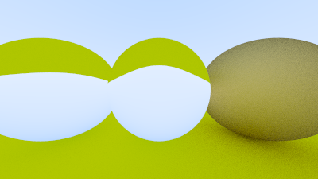
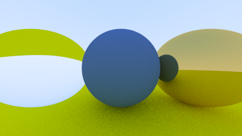
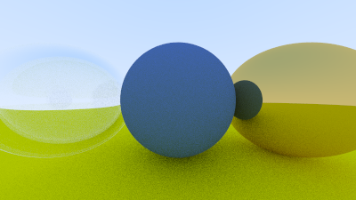

# Atividade 06 - Metal e Vidro

### Fontes
Tutorial: https://raytracing.github.io/books/RayTracingInOneWeekend.html

### Roadmap
1) - [X] Siga o tutorial, especialmente as seções 10 e 11.
2) - [X] Implemente o materiais com reflexão e refração.
3) - [X] Visualize uma cena com um objeto metálico e outro de vidro.
4) - [X] Documente adequadamente

## Documentação

### Tutorial, seções 10 (Metal) e 11 (Vidro)
Com a **seção 10**, criei uma classe abstrata `material.h`para materiais que produz um raio espalhado, assim absorve o raio incidente, e se estiver disperso, diz quanto o raio deve ser atenuado. Alpem disso, uma estrutura de dados para descrever interseções raio-objeto. Portanto, seguindo os passos iniciais da seção executei o arquivo `programa` para gerar a cena com 3 esferas, sendo duas brilhantes (esquerda e direita) e outra não. Cena armazenada no arquivo `esfera_brilha`.

Depois, a seção apresenta a reflexão fuzzy. Com isso podemos randomizar a direção refletida usando uma pequena esfera e escolhendo um novo ponto final para o raio. Observa-se quanto maior a esfera, mais "fuzzy" serão os reflexos. Portanto, após aplicar as mudanças nota-se que na esfera da direita quase não se ve a esfera do meio mais. A cena gerada está no arquivo `metalFuzzy`.

Já na **seção 11**, os materiais abordados são os *dielétricos*, que são materiais transparentes como água, vidro e diamante. Isso acontece quando um raio de luz os atinge, ele se divide em um raio refletido e um raio refratado (transmitido). O tutorial lida com isso escolhendo aleatoriamente entre reflexão e refração, gerando apenas um raio espalhado por interação. **Refração**: descrita pela lei de Snell. No código houve a adição da classe de materias "vidro". A cena resultante está no arquivo `esfera_vidro`.

Reflexão interna total, percebe-se que a imagem acima não é provida de beleza, pois quando o raio está no material com o índice de refração mais alto, não há solução real para a lei de Snell e, portanto, não há refração possível. Por isso o tutorial define que se não existir uma solução, o vidro não pode refratar e, portanto, deve refletir o raio. Com isso tem-se uma cena que tem esferas que as vezes refrata, está no arquivo `refrata_reflete`.

Aproximação de Schlick. Agora, o vidro real tem refletividade que varia com o ângulo >> espelho. Usando uma aproximação polinomial de Christophe Schlick. Isso produz o material de vidro completo. A cena resultante está no arquivo `esferaXilick`.

Após esses passos a passos termina-se as seção 10, sobre reflexão (metal), e seção 11, sobre refração (vidro). 

### Implementação de materiais com reflexão e refração e Visualização de uma cena com um objeto metálico e outro de vidro
Essas etapas ocorrem no decorrer do tutorial seguido, apresentada nas imagem resultantes. Assim a última imagem gerada.

### Documentação do projeto e códigos

A documentação da atividade foi construída ao longo de seu desenvolvimento, pontuando as etapas de cada passo percorrido.  
Para os códigos, comentei em português as partes que achei necessário e utilizei dos textos do próprio tutorial em determinados pontos para explicar melhor o que determinados trechos fazem.