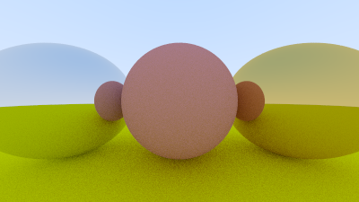
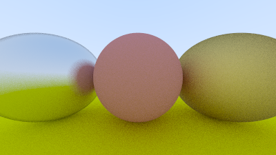

# Atividade 06 - Metal e Vidro

### Fontes
Tutorial: https://raytracing.github.io/books/RayTracingInOneWeekend.html

### Roadmap
1) - [X] Siga o tutorial, especialmente as seções 10 e 11.
2) - [] Implemente o materiais com reflexão e refração.
3) - [] Visualize uma cena com um objeto metálico e outro de vidro.
4) - [X] Documente adequadamente

## Documentação

### Tutorial, seções 10 e 11
Com a **seção 10**, criei uma classe abstrata `material.h`para materiais que produz um raio espalhado, assim absorve o raio incidente, e se estiver disperso, diz quanto o raio deve ser atenuado. Alpem disso, uma estrutura de dados para descrever interseções raio-objeto. Portanto, seguindo os passos iniciais da seção executei o arquivo `programa` para gerar a cena com 3 esferas, sendo duas brilhantes (esquerda e direita) e outra não. Cena armazenada no arquivo `esfera_brilha`.

Depois, a seção apresenta a reflexão fuzzy. Com isso podemos randomizar a direção refletida usando uma pequena esfera e escolhendo um novo ponto final para o raio. Observa-se quanto maior a esfera, mais "fuzzy" serão os reflexos. Portanto, após aplicar as mudanças nota-se que na esfera da direita quase não se ve a esfera do meio mais.

### Implementação de materiais com reflexão e refração

### Visualização de uma cena com um objeto metálico e outro de vidro

### Documentação do projeto e códigos

A documentação da atividade foi construída ao longo de seu desenvolvimento, pontuando as etapas de cada passo percorrido.  
Para os códigos, comentei em português as partes que achei necessário e utilizei dos textos do próprio tutorial em determinados pontos para explicar melhor o que determinados trechos fazem.